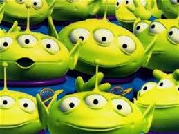

# JavaScript and DOM Manipulation Homework

The extra-terrestrial menace has come to Earth and we need to be prepared. We have collected all eye-witness reports; what we need now is put this information online for the world to see. Your mission, should you chose to accept it, is to transform a JSON-format file into a beautiful site in which our faithful followers will be able to query all sightings.

### Project Description
In this homework we had to work with different technologies (javascripts, HTML, CSS) and create an harmonious  application; life is getting interesting.

The objective was to read json information from a file and render it in a HTML application which will provide an easy-to-use filter, so the user will be able to reduce the amount of data to render depending on the values provided.

### Quick Start
There are 2 directories:
1. UFO-level-1: The application offers one filter ONLY: date. It takes the date (as is) and uses it to filter the data set.
2. UFO-level-2: The application offers several filters so the user could narrow down quite specifically teh data set.

To execute:
* Copy the directory that you would like to execute
* Navigate to the directory
* Execute file index.html

## Contributing

I would like to thank my regular contributors:
* StackOverflow
* Justin Parker

## Author
* Martha Aguilar

